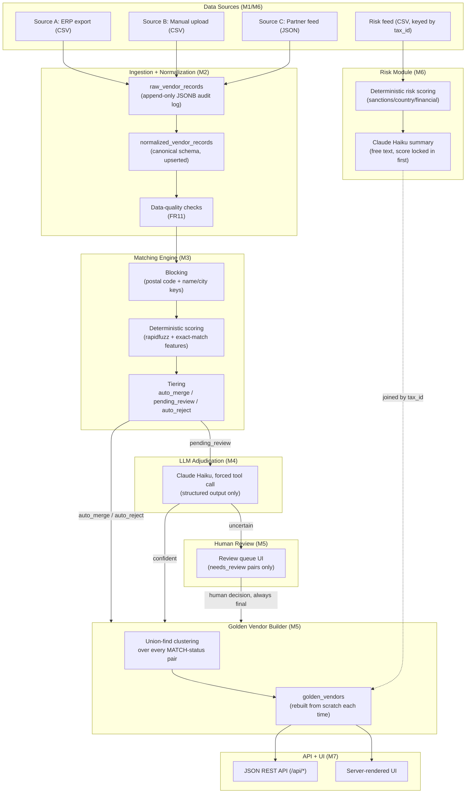
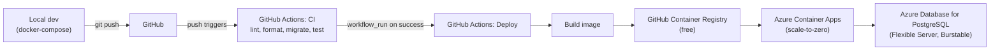

# Architecture

## System overview

Four synthetic data sources feed a pipeline that resolves duplicate vendor identities and attaches a risk signal, exposed through both a server-rendered review UI and a JSON REST API.

## Deployment architecture (M8)

CI must pass before CD is even attempted — `workflow_run` gates the deploy job on CI's `success` conclusion, so a failing test can never reach production.

## Consolidated decision log

| Decision | Alternatives considered | Why this |
|---|---|---|
| PostgreSQL (relational) | NoSQL/document store | Data has real relationships (record → match → golden vendor → review) needing transactional integrity on merges; NoSQL suits schema-variable, relationship-free documents, which this isn't. |
| Batch/ELT pipeline | Streaming (Kafka etc.) | Vendor master updates aren't sub-second real-time; streaming infrastructure would shift effort from the actual hard problem (entity resolution) to infra plumbing that isn't needed. |
| Land-then-transform (raw JSONB, then canonical schema) | Transform-on-ingest (ETL) | Preserves source fidelity/audit trail; each stage independently testable. |
| Deterministic scoring + LLM only for the borderline band | LLM-for-every-pair; pure deterministic string matching | LLM-for-everything doesn't scale in cost/latency and is hard to audit; pure deterministic misses semantic equivalences (abbreviations, legal-suffix variants). Blocking narrows the field, deterministic scoring resolves the easy calls, LLM only touches the ambiguous ~1%. |
| FastAPI (Python) | Node/TypeScript full-stack | Matches existing Python/SQL fluency; avoids learning a new language and new algorithms (entity resolution) at the same time. |
| Server-rendered MVP UI, React deferred | React SPA from the start | Proves the matching/review workflow before investing in frontend build tooling and API-contract design. |
| Forced tool-call output for match adjudication (M4) | Free-text LLM output parsed with regex/heuristics | The model's only possible output is a schema-validated judgment — no channel exists for prompt injection to produce anything except those three fields, regardless of what an adversarial record field contains. |
| Free-text output for risk summaries (M6) | Also forcing structured output | This is a generation task, not a classification decision — the risk score is computed deterministically *before* the LLM runs, so free text is the right shape and the worst case of an injection attempt is a misleading sentence, never a changed risk category. |
| `llm_adjudications`/`human_reviews` keyed by `(record_id_1, record_id_2)` | Keyed by `match_candidate_id` (the original, buggy design) | `match_candidates` is append-only — a fresh matching-engine run always creates new candidate rows with new IDs. Keying decisions to that ephemeral ID meant every re-run silently orphaned prior LLM/human decisions, contradicting the "idempotent, cost-safe to re-run" goal. Found by actually re-running the pipeline, not by inspection. |
| `vendor_risk_profiles` keyed by `tax_id` | Keyed by `golden_vendor_id` (FK) | `golden_vendors` is fully rebuilt (new UUIDs) on every change — a stored FK to it would break on every rebuild. `tax_id` is also what a real external risk feed would actually key by. |
| Azure Container Apps | Azure App Service | Scales to zero — near-$0 cost when idle. App Service's cheapest container-capable tier runs continuously (~$13/month) regardless of traffic. |
| GitHub Container Registry | Azure Container Registry | Free, versus ACR Basic's ~$5/month, for a capability this project doesn't need beyond what GHCR already provides. |
| Union-find, full rebuild each time (golden vendors) | Incremental cluster patching | Simpler and can't drift into an inconsistent partial state; cheap enough at ~5,000 records to run synchronously after every human decision. |

## Known limitations (see PROJECT_STATUS.md "Technical Debt" for the full list)

- Dashboard/vendor-list/API queries load full result sets into Python rather than using SQL-level `COUNT`/`GROUP BY`/pagination — fine at ~5,000 records, would need addressing at real production scale.
- The Container App (West US 2) and Postgres server (Central US) live in different Azure regions, due to regional capacity/restriction errors hit during provisioning — adds avoidable cross-region latency.
- `/api/pipeline/ingestion` runs synchronously in the request; a real deployment would move this to a background task queue.
